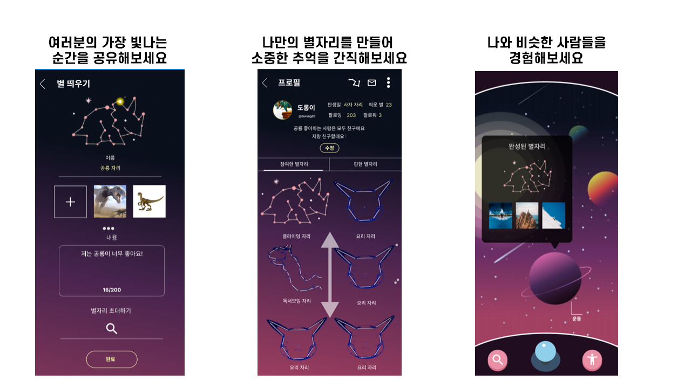
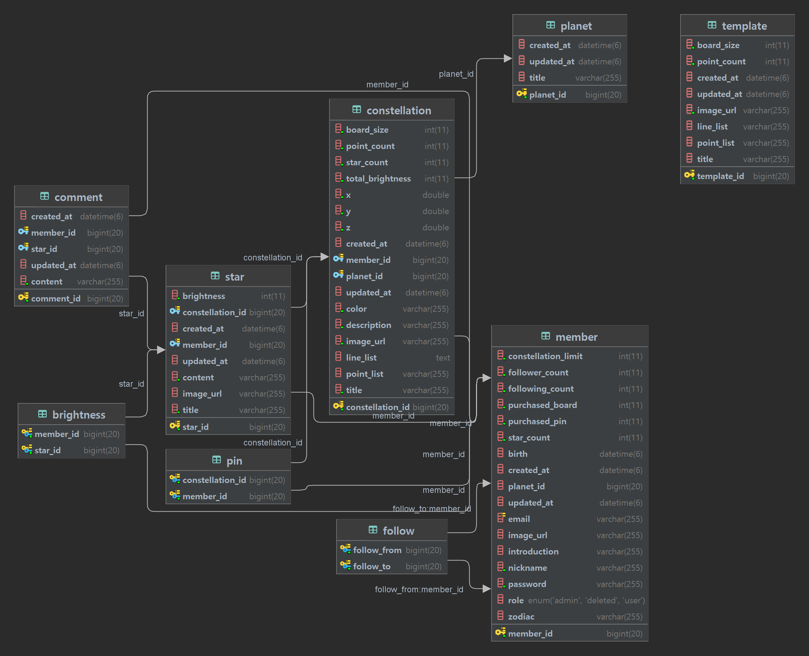
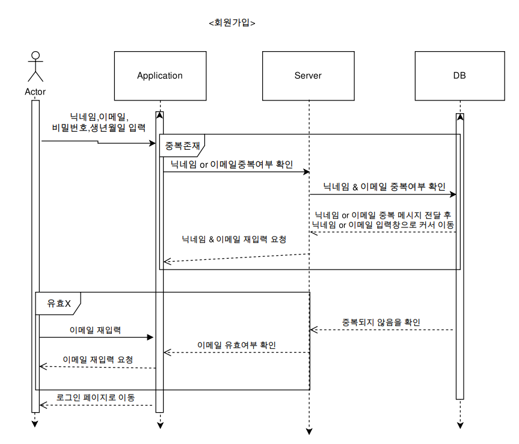
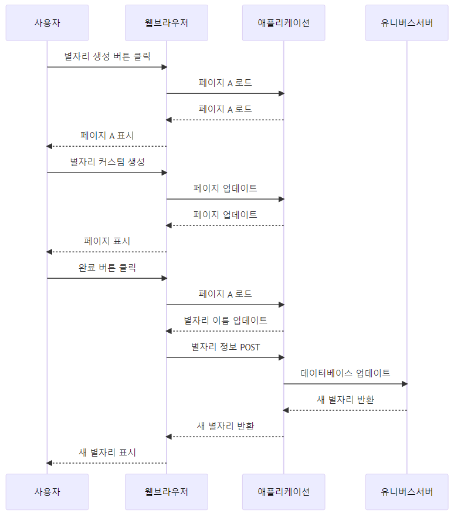
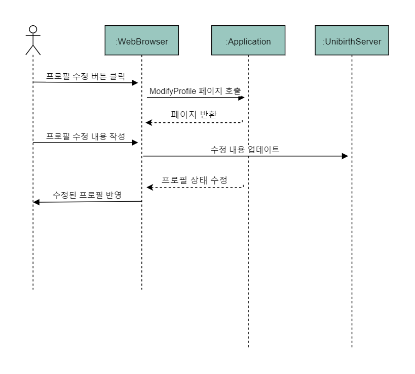
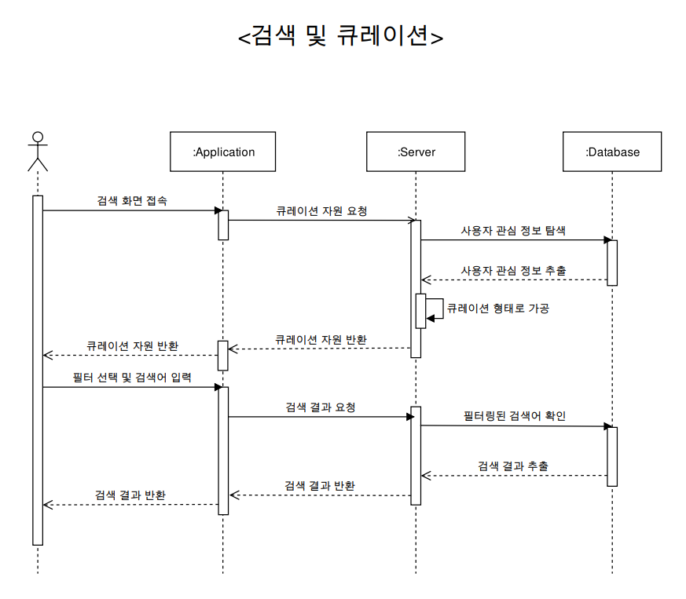

# Uni-Birth

------------------- 이 자리에 UCC 넣기! -------------------

## 목차

1. [서비스 소개](#✨-1-서비스-소개)
2. [+주요 기능](#✨-2-주요-기능)
3. [비즈니스 모델](#✨-3-비즈니스-모델)
4. [구성원](#✨-4-구성원)
5. [진행 기간](#✨-5-진행-기간)
6. [+시스템 아키텍쳐](#✨-6-시스템-아키텍쳐)
7. [기술 스택](#✨-7-기술-스택)
8. [ER Diagram](#✨-8-er-diagram)
9. [Sequence Diagram](#✨-9-sequence-diagram)
10. [협업툴](#✨-10-협업툴)
11. [코드 컨벤션](#✨-11-코드-컨벤션)
12. [커밋 컨벤션](#✨-12-커밋-컨벤션)
13. [Git Flow 브랜치 전략](#✨-13-git-flow-브랜치-전략)
14. [실행 방법](#✨-14-실행-방법)

## ✨ 1. 서비스 소개

> ⭐ 여러분의 가장 빛나는 순간을 우주에 간직해 보세요.

Uni-Birth는 Universe와 Birth의 합성어로, 우주라는 광활한 공간에 자신만의 별과 별자리를 만들어 나가는 SNS 큐레이션 웹 서비스입니다.



- <b> 여러분의 가장 빛나는 순간을 별로 띄워 공유하세요. </b>
- <b> 나만의 별자리를 만들어 소중한 추억을 간직하세요. </b>
- <b> 나와 비슷한 성향의 사람들의 별을 추천받아요. </b>

## ✨ 2. 주요 기능

### 1. 별자리 만들기

------------------- 이 자리에 각 기능별 gif 넣기! -------------------

- 사용자가 격자판에 여러 선으로 그린 별자리 저장 및 3D로 별자리 자동 생성
- 별자리 템플릿 불러오기 및 템플릿 커스텀 기능 제공
- 만들어진 별자리로 친구를 초대하는 알림 보내기 기능 제공

### 2. 게시판 기능

- 별자리(게시판) 안에 들어가는 별(게시글)에 대한 CRUD 기능
- 별자리를 핀 해서 보관할 수 있는 기능
- 내가 참여한 별자리만 볼 수 있는 기능
- 좋아요를 수치가 아닌 밝기로 표시하는 기능

### 3. 별 큐레이션

- 아래의 기준을 통해 사용자에게 별을 추천
  1.  팔로우한 사람 중에 랜덤으로 1명을 골라서 그 사람이 가장 최근에 작성한 별 추천
  2.  회원가입 시 선택한 관심 행성에서 랜덤으로 별자리를 1개 가져온 후, 그 중의 가장 밝은 별 추천
  3.  전체 별에서 랜덤으로 2개 이상의 별 추천

### 4. 팔로우 및 메시지

- 사용자 간 프로필 조회 및 팔로우 가능
- 팔로잉, 팔로워 목록 제공 및 1:1 메시지를 통한 소통 기능

### 5. 검색

- 다양한 카테고리(전체, 별자리, 별, 닉네임)로 검색 가능
- 메시지방 목록에서 닉네임 검색으로 메시지방 찾기 가능

## ✨ 3. 비즈니스 모델

- 별자리 그리기에서 기본 제공 격자판 외 격자판 크기 원할 시 추가 비용 발생
- 핀할 수 있는 별자리 개수 제한 및 개수 증가 원할 시 추가 비용 발생
- 별자리 생성 가능 개수를 별 띄우기 참여 비율에 비례해 제한하여 별 띄우기 참여 유도

## ✨ 4. 구성원

## 1. Front

|                                           |  이름  | 역할                                 |
| :---------------------------------------: | :----: | :----------------------------------- |
|  | 김민섭 | -Front Lead <br> - Main flow         |
|  | 이성섭 | -3D rendering <br> - Components flow |
|  | 정준혁 | -2D canvas <br> - Architecture flow  |

## 2. Back

|                                           |  이름  | 역할                                                   |
| :---------------------------------------: | :----: | :----------------------------------------------------- |
|  | 이승엽 | - 조장<br> - Team Lead <br> - 발표 <br> - Jira 관리    |
|  | 김경륜 | - Back-lead <br> - 회의 진행 <br> - 노션 관리          |
|  | 태준모 | - Backend <br> - 서기 <br> - 3D 이미지 구현 <br> - UCC |

## ✨ 5. 진행 기간

2023.07.04 ~ 2023.08.18 (6주)

## ✨ 6. 시스템 아키텍쳐

------------------- 이 자리에 시스템 아키텍쳐 이미지 넣기! -------------------

## ✨ 7. 기술 스택

### 1. Front


- React로 사용자와의 상호작용이 많은 웹 페이지를 효율적으로 구현하고 관리하였습니다.
- Recoil을 이용해 API 응답 데이터를 캐싱함으로써 서버 통신 비용을 줄였습니다.
- Konva를 이용해 격자판에 별자리를 편리하게 그릴 수 있도록 구현하였습니다.
- Three.js를 이용해 3차원 우주, 별자리를 자연스럽게 구현하였습니다.

### 2. Back


- Springboot로 웹 어플리케이션 서버를 구축하였습니다.
- Spring Data JPA(Hibernate) 로 객체 지향 데이터 로직을 작성하였습니다.
- QueryDSL 로 컴파일 시점에 SQL 오류를 감지하고, 더 가독성 높은 코드를 작성하였습니다.
- AWS EC2를 이용해 서버를 배포하였습니다.

### 3. DB


- MariaDB로 RDBMS 기반의 데이터 설계를 하였습니다.
- Redis로 이메일 인증코드를 캐싱하고 유효 시간을 제한하여 속도를 개선하고 보안을 강화하였습니다.

## ✨ 8. ER Diagram



## ✨ 9. Sequence Diagram










## ✨ 10. 협업툴

- Gitlab
- Jira
- Notion
- Mattermost
- Google meet

## ✨ 11. 코드 컨벤션

### 1. Front

- 싱글 쿼트 대신에 더블 쿼트를 사용합니다.
- 화살표 함수의 인수에 항상 괄호를 사용합니다. 예: (x) => x
- 문장 끝에 세미콜론을 항상 사용합니다.
- 스페이스를 사용하여 들여쓰기합니다. true일 경우에는 탭을 사용합니다.
- 들여쓰기의 너비를 2 스페이스로 설정합니다.
- 한 줄에 80자를 넘지 않도록 코드를 개행합니다.
- 객체, 배열 등이 여러 줄에 걸쳐있을 때, 마지막 항목 뒤에도 항상 쉼표를 사용합니다.
- React 이벤트 핸들러는 소문자가 아닌 캐멀케이스(camelCase)를 사용합니다.
- 컴포넌트 명은 파스칼케이스(PascalCase)를 사용합니다. 기능 + 상위폴더명.jsx

### 2. Back

- 변수명은 camelCase를 사용하고 명사로 명명합니다.
- 함수명은 camelCase를 사용하고 동사로 명명합니다.
- 클래스 명은 UpperCase를 사용하고 명사로 명명합니다.
- 클래스 선언, 메서드 선언, 조건/반복문의 시작 중괄호`{`는 선언부와 같은 줄에 사용합니다.
- 조건문, 반복문에서 중괄호`{}`는 생략하지 않습니다.
- 함수의 행 길이는 25줄 이하로 작성하는 것을 지향합니다.
- 배열 선언시 대괄호`[]` 는 타입 옆에 지정합니다. 예: String[] args (O), String args[] (X)
- 약어는 camelCase를 사용합니다. 예: Url (O), URL (X)
- DTO 클래스는 요청은 xxxReqDto, 응답은 xxxResDto로 명명합니다.
- 약어는 지양합니다. 예: image (O), img (X)
- LocalDateTime 타입의 변수는 xxxAt으로 네이밍합니다.
- 컬럼명에 테이블명을 붙이지 않습니다. 예: id (O), memberId (X)

## ✨ 12. 커밋 컨벤션

- feat: 새로운 기능을 추가할 경우
- fix: 버그를 고친 경우
- style: 코드 포맷 변경, 간단한 수정, 코드 변경이 없는 경우
- refactor: 프로덕션 코드 리팩토링
- docs: 문서를 수정한 경우
- chore: 기타

## ✨ 13. Git Flow 브랜치 전략

### 1. Front

- 각 기능별로 브랜치를 생성하고, dev 브랜치로 pull request를 통해 merge한다.
- dev 브랜치로 merge가 완료된 후 master 브랜치로 merge 한다.

### 2. Back

- 각 팀원별로 브랜치를 생성하고, dev 브랜치로 pull request를 통해 코드 리뷰 후 merge한다.
- dev 브랜치로 merge가 완료된 후 master 브랜치로 merge 한다.

## ✨ 14. 실행 방법

### 1. 클라이언트

1. 원격 저장소 복제

   ```bash
   $ git clone https://lab.ssafy.com/s09-webmobile2-sub2/S09P12A410.git
   ```

2. 프로젝트로 이동

   ```bash
   $ cd ~/S09P12A410/unibirth-fe
   ```

3. 필요한 모듈 설치

   ```bash
   $ yarn install
   ```

4. 프로젝트 build

   ```bash
   $ yarn build
   ```

5. 개발 서버 실행

   ```bash
   $ yarn start
   ```

### 2. 서버

1. 원격 저장소 복제

   ```bash
   $ git clone https://lab.ssafy.com/s09-webmobile2-sub2/S09P12A410.git
   ```

2. main 폴더로 이동

   ```bash
   $ cd S09P12A410/unibirth-BE/src/main
   ```

3. resources 폴더 생성 및 이동

   ```bash
   $ mkdir resources
   $ cd resources/
   ```

4. application.yml 파일 생성 및 작성

   ```bash
   $ touch application.yml
   $ vi application.yml
   ```

   ```yaml
   spring:
   datasource:
     url: # MariaDB Connection URL
     driver-class-name: org.mariadb.jdbc.Driver
     username: # 사용자명
     password: # 비밀번호
     hikari:
       maximum-pool-size: 3

   mail:
     host: smtp.gmail.com
     port: 587
     username: # 아이디@gmail.com
     password: # 비밀번호
     properties:
       mail:
       smtp:
         starttls:
           enable: true
         auth: true
         timeout: 300000
       debug: true
     protocol: smtp
     default-encoding: UTF-8

   jpa:
     hibernate:
       ddl-auto: update
     properties:
       hibernate:
       format_sql: true
   data:
     web:
       pageable:
       default-page-size: 10
       max-page-size: 2000
       one-indexed-parameters: true
     redis:
       host: # localhost
       port: 6379
       password: # 비밀번호
   security:
     user:
       name: # 사용자명
       password: # 비밀번호

   jwt:
   header: Authorization
   salt: # salt
   expire: 86400000
   bearer: Bearer

   logging.level:
   org.hibernate.SQL: debug
   ```

5. 프로젝트 폴더로 이동

   ```bash
   $ cd ~/S09P12A410/unibirth-BE/
   ```

6. 프로젝트 build

   ```bash
   $ chmod +x ./gradlew
   $ /gradlew build
   ```

7. 실행

   ```bash
   $ java -jar unibirth-0.0.1-SNAPSHOT.jar
   ```
